---
categories:
  - AI
---

[Lovable](https://lovable.dev/) is an AI coding assistant that helps you build web apps faster with AI-generated code. It is built on top of [Supabase](https://supabase.com/) and provides a no-code/low-code platform to create web applications quickly.

Below is my experience with using it to build a simple web app getaddresscsv.com that allows users to upload a CSV of addresses and get back parsed addresses using [Libpostal](https://github.com/openvenues/libpostal).

## Initial startup & first impressions

The lovable interface is very simple and easy to use. I was able to setup and configure a simple web app in under 30 minutes with these components:

1. Saas app - Frontend built with React and TailwindCSS
2. Auth - Google OAuth
3. Custom domain and configuration with Cloudflare
4. Database - Supabase (hosted by lovable)
5. Stripe - Payments, Lovable automatically sets up the stripe integration for you and create product tiers.
6. Github intergration - for code versioning

## Scope creep and Lovable limitations

Initially I had set the project up using lovables cloud integration with supabase, this has several limitations.
Unfortunately lovable does not allow you to disconnect from their hosted supabase cloud easily. To migrate you have to create a new lovable project and connect to your own supabase account.

Some of the features you get with having your own free supabase account are:

* Direct sql access
* More auth options (lovable only offers google auth)
* Improved logging and monitoring

However lovable does offer on the free tier:

* Customised domain hosting (supabase free tier does not)

_If you are technical and want to have more control of the supabase cloud that lovable uses under the hood make sure to create a free supabase account [here](https://supabase.com/). Then link it to lovable when you sign up. Otherwise you will need to do a migration later which can be a bit tedious._

## Migrating Lovable supabase project to your own supabase account

<iframe width="560" height="315" src="https://www.youtube.com/embed/jEBVpl1GBvQ?si=CIxQDqtWK_TaKWR4" title="YouTube video player" frameborder="0" allow="accelerometer; autoplay; clipboard-write; encrypted-media; gyroscope; picture-in-picture; web-share" referrerpolicy="strict-origin-when-cross-origin" allowfullscreen></iframe>

## Tips

1. Use a supabase account vs lovable hosted cloud to avoid lockin and tedious migration in future.
2. Add a test user in lovable or supabase user settings to allow easy testing of auth flows and role based access and features.
3. Update the favicon from within the publish settings to avoid the default lovable favicon.

## GetAddressCSV.com development and infrastructure story

The initial getaddresscsv parsing was very basic using custom code in javascript, this obviously could not cater to all the differing address formats around the world.

To improve the address parsing I decided to use [Libpostal](https://github.com/openvenues/libpostal) which is a C library for parsing addresses using statistical NLP methods. 'I' (AI claude opus 4.5) created a simple REST api using FastAPI and Docker that exposes an endpoint to parse addresses. I hosted the libpostal docker image on Hetzner cloud using the smallest cloud server for $4 euro per month!

My workflow also changed a bit and I preferred using vscode and copilot with Claude Opus 4.5 :fire: instead of the lovable code editor for more complex coding tasks.

The final architecture of getaddresscsv.com is as follows:

[Available icons](https://mermaid.ai/docs/icons/intro)

```mermaid
architecture-beta

    service cust(server)[Customer]

    group supabase(logos:supabase-icon)[Supabase]

    service db(logos:postgresql)[Postgres] in supabase
    service auth(logos:auth0)[Auth] in supabase
    service functions(icon:fa:building)[Edge Functions] in supabase

    group lovable(logos:lovable)[Lovable]

    service web(server)[Frontend Web] in lovable
    service domain(logos:aws-glacier)[Custom Domain] in lovable

    group github(logos:github-octocat)[github]
    service repo(server)[Repository] in github
    service actions(logos:aws-cloudtrail)[Actions] in github

    group hetzner(logos:hetzner)[hetzner]

    service vps(server)[VPS] in hetzner
    service docker(logos:docker)[Docker Libpostal] in hetzner

    group stripe(logos:stripe)[stripe]
    service subscribe(server)[Subscriptions] in stripe

    group cloudflare(logos:cloudflare)[cloudflare]
    service dns(server)[DNS] in cloudflare
    service domainreg(server)[Domain registar] in cloudflare

    cust:R --> L:web
    web{group}:R --> L:functions{group}
    auth:R --> L:db

    web{group}:T --> B:domainreg{group}
    web{group}:B --> T:repo{group}
    functions{group}:B --> T:subscribe{group}
    functions{group}:T --> B:docker{group}
```

## Cost overview

_USD currency_

* Lovable - $5 on lite plan
* Hetzner - $4 pm for smallest VPS hosting libpostal docker image
* Supabase - Free plan is sufficient for small projects
* Github copilot - $10 pm (LLMS incl Claude Opus 4.5)

## Future plans

* Consolidate services to docker hosting only on hetzner to reduce dependanies on lovable and supabase cloud.
* Create more projects and apps using AI tools
* Marketing and promotion.

## Summary

I am not expecting to make any money from getaddresscsv.com but it was a great learning experience using lovable to quickly prototype and build a web app with minimal coding. The integration with supabase and stripe made it easy to add auth and payments without much hassle.

I look forward to creating more projects using the latest AI tools.